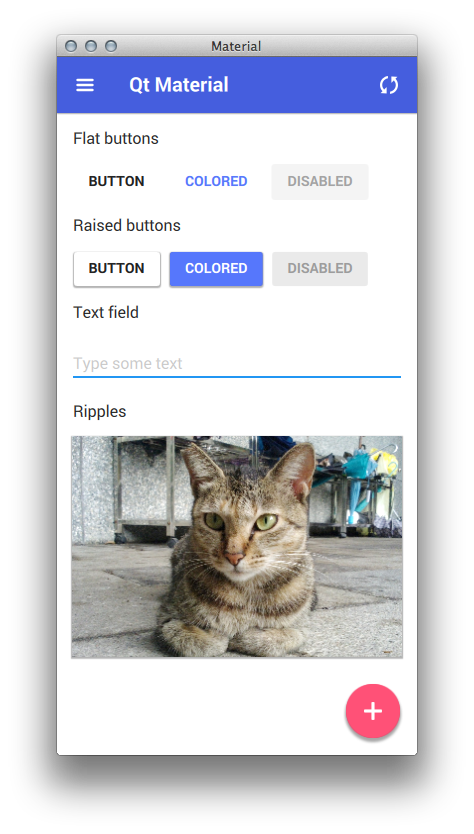
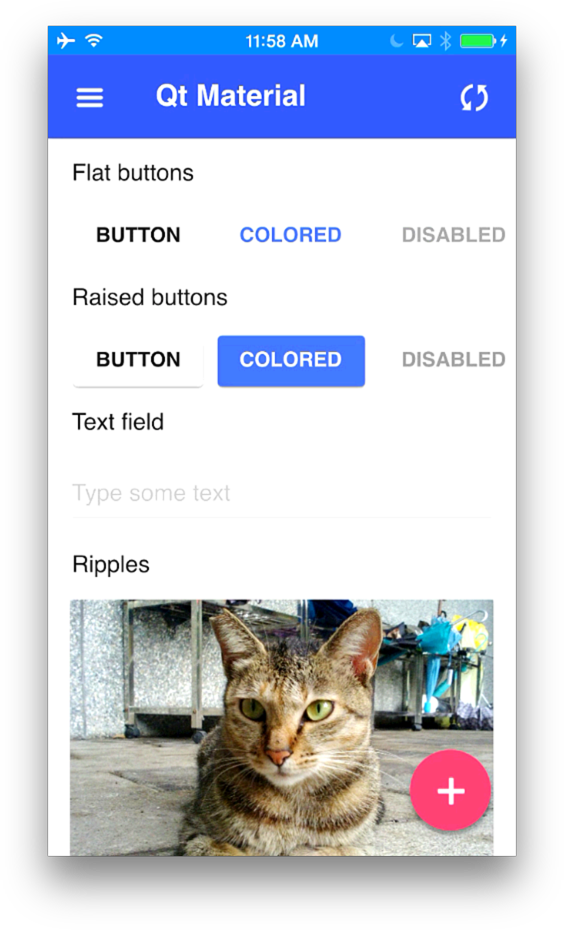
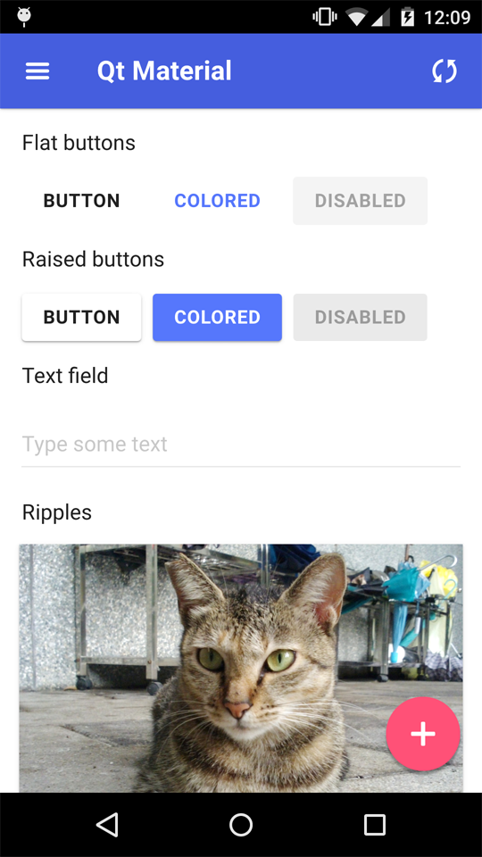

Material
===
Material Design components built using Qt/QML.

Authored by [RSChiang](http://github.com/RSChiang) on GitHub.

Added iOS/Android support by [firatagdas](https://github.com/firatagdas) on GitHub.